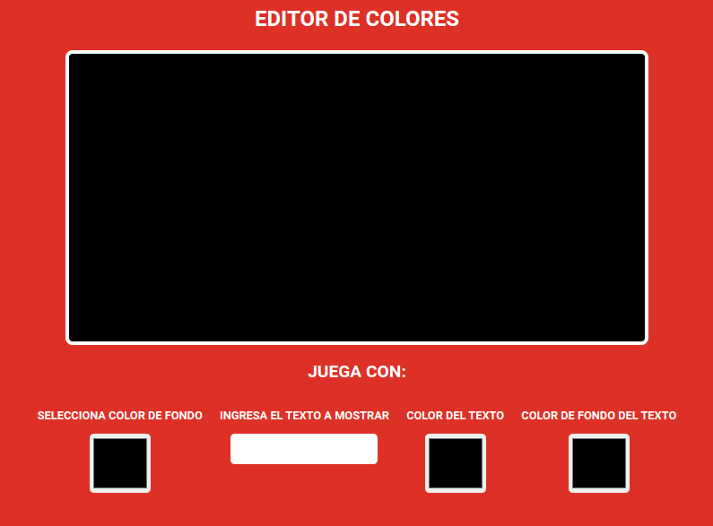
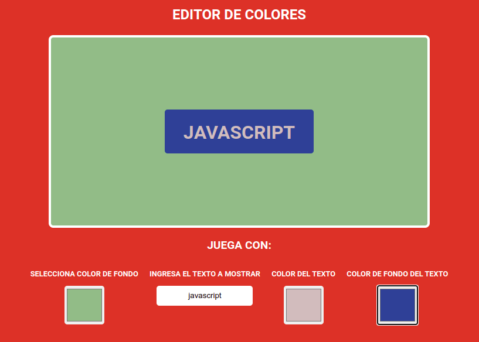

<!-- header -->
# Cambia Colores-app (javascript)

Small application where you can change the background of the box, add a text, change the color of said text and change the background of the text made in javascript with a little bit of css. / Pequeña aplicacion donde puedes cambiar el fondo del recuadro, agregarle un texto cambiar el color de dicho texto y cambiar el fondo del texto hecha en javascript con poquito de css.

---

---

---

# [Pruebalo aqui](https://gac982.github.io/change-color-app/ "demo")
